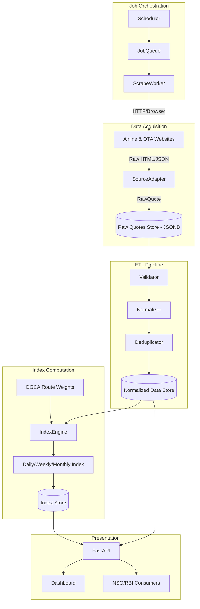

# 03 System Architecture

## High-Level Architecture Overview
The APIx system is structured as a modular, data-driven pipeline. It is decoupled into independent subsystems that handle data acquisition, normalization, storage, computation, and presentation. 

### Subsystems

1. **Scraping Engine & Source Adapters (Data Acquisition)**
   - Responsible for fetching raw HTML/JSON from airline and OTA sources.
   - Designed around a `BaseFetcher` interface (supporting both `HttpFetcher` and Playwright-based `BrowserFetcher`).
   - Extracts raw pricing data and converts it into standard `RawQuote` objects.
   - Saves all raw data into PostgreSQL (as JSONB) to ensure an immutable audit trail and allow offline re-parsing.

2. **Data Pipeline (ETL & Normalization)**
   - Consumes `RawQuote` objects.
   - Validates data against the domain schema.
   - Handles missing fields, currency normalization, and extracts fare components (base fare, taxes, convenience fees).
   - Deduplicates identical flights across different sources (e.g., an IndiGo flight scraped from MakeMyTrip and directly from IndiGo).
   - Saves cleaned data into `normalized_quotes` tables.

3. **Index Engine (Computation)**
   - Queries the `normalized_quotes` table.
   - Applies NSO/DGCA route weights.
   - Computes base-period comparisons to generate the daily, weekly, and monthly Airfare Price Indices.
   - Stores computed index values in the `index_observations` table.

4. **Job Orchestration**
   - Scheduled via Celery (or APScheduler for the prototype).
   - Generates scraping jobs across multiple dimensions: Routes × Sources × Purchase Windows (T+1, T+7, T+15, T+30, T+45).
   - Manages retries, timeouts, and circuit breakers for failing sources.

5. **API & Dashboard (Presentation Layer)**
   - **API (FastAPI):** Exposes RESTful endpoints for the dashboard and external consumers (NSO/RBI).
   - **Dashboard (Next.js/React):** Visualizes the Airfare Price Index, historical trends, sector heatmaps, and lead-time elasticity curves.

## Flow Diagram

## Infrastructure Choices
- **Database:** PostgreSQL (chosen for strict relational schema for normalized data + JSONB for raw scraping audits).
- **Backend/API:** Python + FastAPI (high performance, built-in async for fetching).
- **Scraping Transport:** Playwright + httpx + aiohttp.
- **Frontend:** Next.js + Recharts/DeckGL.
- **Queue/Workers:** Redis + Celery (or APScheduler).
